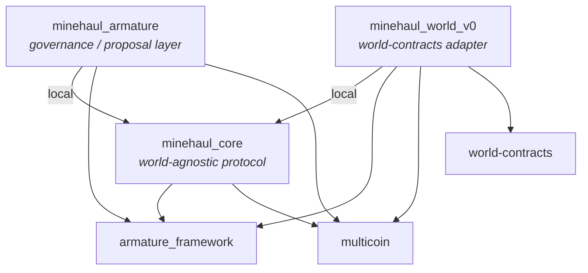

# ADR 0001: Package and dependency structure

- **Status:** Accepted
- **Decided:** 2026-06-21 (PRs #6, #7, #8, #10)
- **Recorded:** 2026-09-24
- **Revised:** 2026-09-27 (armature `cycle-7` and loash-industries/armature#168 compatibility check)

## Context

Minehaul coordinates hauling of goods between Smart Storage Units (SSUs) across
gates in EVE Frontier. To do that it has to touch three outside systems:

1. **EVE Frontier world-contracts** (`evefrontier/world-contracts`). This is the
   source of truth for SSUs, gates, characters and ownership caps. CCP versions
   and redeploys it, so a Minehaul release has to outlive at least one world
   version change.
2. **A DAO framework** to decide who may configure a network, list jobs and
   resolve disputes. We use armature (`loash-industries/armature`).
3. **A fungible multi-asset token** to represent cargo, rewards and collateral
   in escrow. We use multicoin (`Algorithmic-Warfare/multicoin`), which is also
   what Trinary Exchange and warehouse-receipts use.

Move has no cross-package `friend`, and a Sui type is identified by the
*published package ID* that defines it. So dependency choices decide which
objects can pass between packages, not just how the code is organised.

## Decision

### 1. Three packages in one repo, in layers

| Package | Role | Depends on |
|---|---|---|
| `minehaul_core` | Protocol state and rules: network, actions, routes, escrow, witnesses, events | armature, multicoin |
| `minehaul_armature` | Wraps core's gated entry points in armature proposal types that a DAO votes on (or bypasses) | core, armature, multicoin |
| `minehaul_world_v0` | Reads world-contracts state and mints proof objects ("witnesses") that core consumes | core, armature, multicoin, world |

### 2. `minehaul_core` never depends on world-contracts

Core describes SSUs and gates only by `ID`. Everything it needs to know about
the world arrives as **hot-potato witnesses**: `VerifiedSsu`, `VerifiedGate`
and `MintedPermit` in `witnesses.move`. Only an authorised adapter package can
mint them, and they must be consumed in the same transaction.

A new world version is therefore handled by publishing a new adapter package
(`minehaul_world_v1`), registering its `AdapterAuth` and revoking the old one.
Core and existing network state stay as they are. ADR 0002 covers the adapter
trust model.

### 3. The governance layer and the adapter don't depend on each other

`minehaul_armature` and `minehaul_world_*` meet only inside a single transaction
(PTB): the adapter mints a witness, and the armature handler passes it into
core. Neither package imports the other, so either can be upgraded or replaced
on its own.

### 4. External dependencies are pinned to full commit SHAs

| Dependency | Repository (subdir) | Pinned rev |
|---|---|---|
| armature | `loash-industries/armature` (`packages/armature_framework`) | `4bd6fbaea43fab3967b0c1627b1bea679abc78c3` |
| multicoin | `Algorithmic-Warfare/multicoin` (`packages/multicoin`) | `c7a97f2f42ffbddbe2d44686cbc9eebd1810b8d6` |
| world | `evefrontier/world-contracts` (`contracts/world`) | `8e2e97b50fd6bbf605284bcdaae54a33a5475e89` |
| Sui, MoveStdlib | `MystenLabs/sui` (implicit) | `367fd808279bed26f7c64fc63160062a2ee29ab7` (from `Move.lock`) |

The same rev is used in every package that declares a dependency, so a bump
has to be made in all manifests at once.

### 5. multicoin is declared with `override = true`

armature at the pinned rev pulls multicoin at a different commit (`330d3393`).
The override makes every package in the graph resolve to one multicoin, which
keeps `multicoin::Balance` a single type across core, armature and the adapter.

armature's `cycle-7` branch pins multicoin `e384bbc8`, the same commit as
Trinary Exchange. Once we move to it and bump our own multicoin pin to match,
the override has nothing to override. Keep it anyway, as protection against
future drift.

### 6. The world pin follows warehouse-receipts

`minehaul_world_v0` pins `world` to the rev that warehouse-receipts uses, so
`world::storage_unit::StorageUnit` and related types are the same type in both
packages. warehouse-receipts itself is **not** a dependency yet. It is only
needed for the inject/extract paths (`deposit_for_receipt` /
`redeem_receipt`), and including it now would pull its failing tests into our
test runs.

### 7. Target environment

All packages declare `testnet_wip = "4c78adac"` (Sui testnet chain ID). CI
([`.github/workflows/pr.yml`](../../.github/workflows/pr.yml)) builds and tests
every `packages/*` with `-e testnet`.

## Consequences

**Positive**

- A world-contracts upgrade touches one adapter package, not the protocol.
- Governance and world integration can change independently.
- Pinned SHAs give reproducible builds, and `Move.lock` records the full
  resolved graph.

**Negative / costs**

- An armature or multicoin bump has to be repeated in all three `Move.toml`
  files, and every bump means regenerating the affected `Move.lock` files.
  (`world` is only declared in `minehaul_world_v0`.)
- Core can't check world facts itself. It trusts whichever adapter is
  registered, so adapter authorisation is security-critical (ADR 0002).
- Type identity ties us to what other packages link. **Any package that
  exchanges `multicoin::Balance` or world objects with Minehaul must link the
  same *published* package (same original ID) on the target environment.**
  Matching source code is not enough.

## Current drift (as of 2026-09-27)

These don't change the decision above, but they must be fixed before deploying
or integrating:

1. **Trinary Exchange links a different multicoin publication.** multicoin's
   Move source is identical at `c7a97f2f` (ours) and `e384bbc8` (TriEx's). Only
   `Published.toml`/`Move.toml` differ, and the published addresses moved:

   | multicoin rev | `testnet_stillness` | `testnet_wip` |
   |---|---|---|
   | `c7a97f2f` (Minehaul) | `0x4a28…07ac` | *(not published)* |
   | `e384bbc8` (TriEx, armature `cycle-7`) | `0x99a4…6cfb` | `0x4a28…07ac` |

   Minehaul targets `testnet_wip`, but its pinned multicoin has no `testnet_wip`
   entry. To accept balances settled on TriEx, Minehaul must move to
   `e384bbc8` (or later) and target the same environment TriEx is deployed on.
   The armature upgrade below requires this bump anyway, so do both together.
2. **`minehaul_world_v0/Move.lock` is stale.** It still pins
   `warehouse_receipts` (`6fdb4e21`) and a third multicoin copy
   (`multicoin_2`), although the manifest no longer declares that dependency.
   Regenerate the lockfile.
3. **armature has a breaking redeploy in progress.** `main` has only five
   commits since our pin (deploy config and docs; no framework code). The
   framework changes are on the `cycle-7` branch:
   - loash-industries/armature#162–#167 (ARMATURE-9 to ARMATURE-15), merged 24–26 Sep 2026: a gas
     overhaul, not upgrade-compatible with existing DAOs.
   - armature#168 (ROAD-39, type permissions), still open, built on top.

   `cycle-7` isn't published yet: its `Published.toml` still lists the old
   addresses. **Stay on `4bd6fbae` until the redeploy is published**, then
   bump armature and multicoin in the same change. See the compatibility
   results below and ADR 0002 for what changes.
4. **world-contracts and Sui pins date from June 2026.** Before bumping
   `world`, check the warehouse-receipts pin (decision 6).

## armature compatibility check (2026-09-27)

Each package was built and tested (`sui move test -e testnet`, Sui 1.72.2)
with armature bumped to the target rev and multicoin to `e384bbc8`. The tests
ran on scratch copies; the repo's manifests are unchanged.

| armature rev | `minehaul_core` | `minehaul_world_v0` | `minehaul_armature` | Changes needed |
|---|---|---|---|---|
| `4bd6fbae` (current pin) | 44/44 | 4/4 | 10/10 | none |
| `cycle-7` `929bb912` | 44/44 | 4/4 | 10/10 after fix | **tests only**: `dao.test_bind_type` was removed (ARMATURE-9). Replace the `test_enable_type` + `test_bind_type` pair with a single `dao.test_enable_type<ConfigureLogisticNetwork>(key, cfg)`. |
| armature#168 `6ed2b77b` | 44/44 | 4/4 | 10/10 after fix | the test fix above, **plus source**: `ticket_request` and `discharge` take a `Permit
`. In `configure_network.move`, add `use std::internal;` and pass `internal::permit()` to all six calls. |

`minehaul_core` and `minehaul_world_v0` need no changes for either rev. Every
armature API they use has the same signature: the type-state accessors,
`is_governance_member`, `ExecutionRequest`, and the `*_for_testing` helpers.

## Upgrading a pin: checklist

1. Change the rev in every `packages/*/Move.toml` that declares the dependency.
2. For multicoin and world, confirm the new rev's `Published.toml` has an entry
   for our target environment, and that it matches what TriEx and
   warehouse-receipts link there.
3. Regenerate each `Move.lock` and run `sui move test` in every package.
4. If the world pin changed, check whether the adapter should become a new
   `minehaul_world_vN` package instead of an in-place edit.
5. If the armature pin changed, rerun the ADR 0002 gap-2 check: a proposal
   type other than `ConfigureLogisticNetwork` must still be unable to write
   the network.
