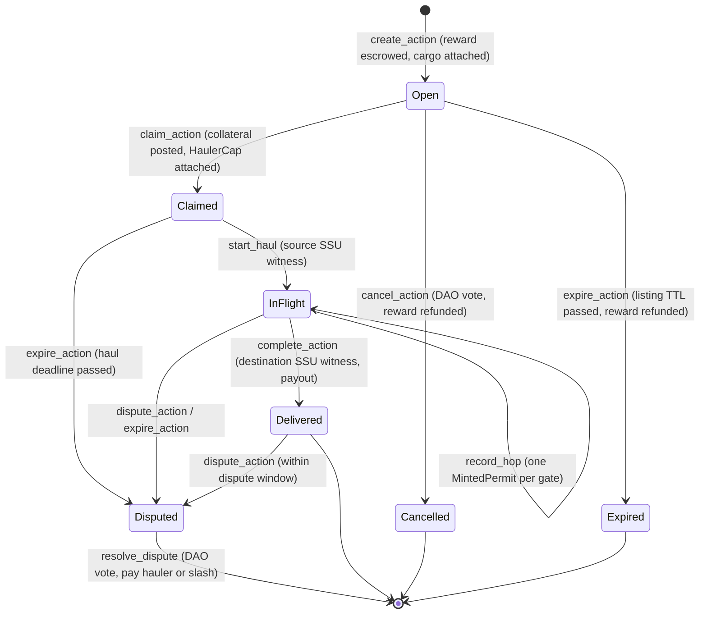

# ADR 0002: Logistic network architecture

- **Status:** Accepted (partially implemented; the haul lifecycle is tracked in #11)
- **Decided:** 2026-06-21 (PRs #6, #7, #8, #10; design issues #1–#4)
- **Recorded:** 2026-09-24
- **Revised:** 2026-09-27 (armature `cycle-7` and loash-industries/armature#168 impact; gap 2 confirmed by tests)

## Context

A **logistic network** is a set of Smart Storage Units (SSUs) and the gates
between them, run by one organisation (a DAO). Goods move in three ways:

- they **enter** the network from outside (a mining output, a member deposit,
  an off-chain import),
- they **transfer** between two SSUs in the network, possibly across gates,
- they **leave** the network to a wallet, a treasury or an off-chain export.

A hauler takes a job, carries the goods through the required gates, and is
paid on delivery. They put up collateral that can be slashed if the job goes
wrong.

Constraints:

- World facts (does this SSU exist, who owns it, is this gate online) live in
  world-contracts, which core may not depend on (ADR 0001).
- Governance comes from armature: proposals are voted on, and executing one
  yields an `ExecutionRequest<P>` / `ExecutionTicket<P>` that authorises a
  state change.
- Sui objects must be designed around shared-object contention: many hauls can
  run at once, so they can't all write to one object.

## Decision

### 1. The network is DAO type-state, one per DAO

`LogisticNetwork` ([network.move](../../packages/minehaul_core/sources/network.move))
is stored inside the DAO as armature **type-state**. It is not a separate
shared object. `network_id` equals the DAO's object ID.

Concretely, armature's `dao::init_type_state<P, S>` adds a Sui dynamic field
to the DAO's `UID`:

- the key is `type_name::with_defining_ids<P>()`, the type name of the
  proposal marker, which stays the same across package upgrades;
- the value is `S`, here `LogisticNetwork` (`store` only, so it has no ID of
  its own).

After the first `SetConfig` proposal executes, the DAO carries:

```
DAO (shared object)
 └─ dynamic field  key   = TypeName(minehaul_armature::configure_network::ConfigureLogisticNetwork)
                   value = LogisticNetwork { config, registered_ssus, registered_gates, … }
```

Writing (`borrow_type_state_mut`, `init_type_state`) requires an
`ExecutionRequest<P>` for the same `P` and the same DAO. Reading
(`borrow_type_state`) needs only `&DAO`. Every write therefore takes the DAO
as a mutable shared input.

It holds:

- `NetworkConfig`: default reward asset, minimum collateral ratio, max route
  length, max cargo lines, permit TTL, dispute window, open-marketplace flag,
  treasury address
- `registered_ssus: VecMap<ID, RegisteredSsu>`
- `registered_gates: VecSet<ID>`
- `auxiliary_haulers: VecSet<address>`
- a `paused` flag and action counters

*Why:* armature already enforces that only an executed proposal can change
type-state, so network governance comes for free and "one network per
organisation" is structural.

### 2. All network changes go through one proposal type with an on-chain payload

armature stores type-state under the proposal-type marker `P`, and a write
requires an `ExecutionRequest<P>` for that same `P`. The original plan (#4)
had separate `RegisterSsu` / `RegisterGate` proposal types, but each of those
would have read and written a *different* storage slot.

Instead, [`minehaul_armature::configure_network`](../../packages/minehaul_armature/sources/configure_network.move)
defines a single `ConfigureLogisticNetwork` proposal type. Its payload is an
enum:

```move
public enum NetworkOp has drop, store {
    SetConfig { config: NetworkConfig },            // first call lazily initialises the network
    RegisterSsuVaulted { ssu_id: ID, cap_id: ID },
    RegisterSsuLeased { ssu_id: ID, lease_id: ID, expires_at_ms: u64 },
    RegisterGate { gate_id: ID },
}
```

The payload is on-chain so that **voters approve the exact operation**. If the
ID were a runtime argument, whoever executes an approved ticket could register
any SSU. Witnesses can't be stored in the payload (they lack `store`), so they
arrive as transaction arguments, and each handler asserts
`witness.id == payload.id` (`EIntentWitnessMismatch`).

From armature#168 on, `ticket_request` and `discharge` take a
`std::internal::Permit<P>`. The compiler only lets the module that *defines*
`P` create one. A compile probe confirmed that even a second module inside
`minehaul_armature` can't spend a `ConfigureLogisticNetwork` ticket (error
`Sui E02011`). Only `configure_network`'s own handlers can act on an approved
network operation, so the payload/witness check above can't be bypassed from
elsewhere.

### 3. World facts come in as adapter-minted hot potatoes

[witnesses.move](../../packages/minehaul_core/sources/witnesses.move) defines
three proof types. None of them has `store` or `copy`, and each must be consumed
in the same transaction:

| Witness | Proves | Consumed by |
|---|---|---|
| `VerifiedSsu` | The SSU exists and the presented `OwnerCap` authorises it | `network::register_ssu`, and haul start/completion |
| `VerifiedGate` | The gate is deployed, online and belongs to this network | `network::register_gate`, `route::new_from_verified` |
| `MintedPermit` | The adapter issued a jump permit through a gate, bound to a route hash, a hauler and an expiry | `route::verify_hop` |

**Adapter trust model.** An adapter package mints one `AdapterAuth` in its
`init`. Each network has an `AdapterRegistry` (a shared object with `key`
only) listing the `AdapterAuth` IDs it accepts. Every `mint_*` checks that the
auth isn't revoked and is listed. Revocation is **global and terminal**: the
flag lives on the auth object, so a revoked adapter stops working on every
network at once.

### 4. SSU ownership mode is recorded at registration

`RegisteredSsu.mode` is either:

- `Vaulted { cap_id }`: the SSU's `OwnerCap` is held in the DAO's capability
  vault, so the network controls it.
- `Leased { lease_id, expires_at_ms }`: a member lends their own SSU to the
  network for a limited time.

This supports both an organisation's own infrastructure and members'
infrastructure without taking custody of the latter.

### 5. Who may haul

`network::assert_can_haul` allows a caller if the network isn't paused and the
caller is **a DAO governance member**, **an auxiliary hauler** (a per-network
allow-list), or **anyone**, when `allow_open_marketplace` is set. The expected
progression is: members only, then trusted outsiders, then an open market.

### 6. One shared `HaulAction` object per job

[action.move](../../packages/minehaul_core/sources/action.move) gives each job
its own shared object, so concurrent hauls don't contend with each other on the
same object. Keeping the DAO out of the haul path too depends on ADR 0003: the
current `create_action` stub still takes `&mut DAO`.

```move
public enum ActionKind {
    Inject   { source: InjectionSource, dst_ssu: ID },   // enters the network
    Transfer { src_ssu: ID, dst_ssu: ID },               // moves inside the network
    Extract  { src_ssu: ID, sink: ExtractionSink },      // leaves the network
}
```

Balances hang off the action's UID as **dynamic object fields**, following the
warehouse-receipts / armature vault pattern:

- cargo: one `multicoin::Balance` per `CargoKey { collection_id, asset_id }`,
  checked against `cargo_manifest`
- reward and collateral: `RewardKey` / `CollateralKey`, managed only by
  [escrow.move](../../packages/minehaul_core/sources/escrow.move), which caches
  their amounts
- the hauler's `HaulerCap` (route cursor, permits remaining, deadline):
  `HaulerCapKey { hauler }`

Planned lifecycle. Every transition below is still `abort 0` and is specified
in #11:



On success, the reward is split `reward_to_hauler_bps` to the hauler and the
remainder to the network treasury, and the collateral is returned. If a
dispute goes against the hauler, `escrow::slash` pays `slash_bps` of the
collateral to the lister.

### 7. Routes are gate lists committed by a hash; routing happens off-chain

A `Route` ([route.move](../../packages/minehaul_core/sources/route.move)) is an
ordered `vector<ID>` of gates plus

```
route_hash = blake2b256( bcs(gates) || bcs(network_id) )
```

- Routes can only be built from `VerifiedGate`s belonging to the network, up to
  `max_route_len` gates.
- Each hop consumes one `MintedPermit`. The permit's route hash, hauler and
  gate must match the next gate in order, and it must not have expired.
  Direction is strict.
- The hash format is a wire contract for adapters (pinned by
  `route_tests::test_route_hash_golden_vector`).
- Inject/Extract actions with no transit use `route::new_empty`.

**Pathfinding is off-chain.** The chain checks a route and its hops but never
searches for one. Only gates the network registered and can issue permits for
(smart gates) can be part of a route.

### 8. History is events

Every state change emits an event from core
([events.move](../../packages/minehaul_core/sources/events.move)):
`NetworkConfigured`, `SsuRegistered`/`Unregistered`,
`GateRegistered`/`Unregistered`, `ActionListed`, `ActionClaimed`,
`HopRecorded`, `ActionDelivered`, `ActionDisputed`, `ActionResolved`,
`ActionExpired`, `ActionCancelled`, `AdapterRegistered`/`Revoked`. Armature
handlers don't emit duplicates. Network history is rebuilt by an indexer; there
is no on-chain history store.

## Consequences

**Positive**

- Governance, world verification and protocol rules are separate, and each can
  be tested on its own.
- Hauls don't contend with each other: each job is its own object. With ADR
  0003 accepted, the DAO is also only written by governance operations.
- Voter-visible intent is binding: an approved ticket can't be redirected to a
  different SSU or gate.
- Cargo is ordinary multicoin, so a trade settled on Trinary Exchange can be
  handed to a `Transfer` action in the same transaction. This requires matching
  multicoin publications (ADR 0001).

**Negative / costs**

- Every haul transaction has to include adapter calls that mint witnesses,
  which makes transactions larger and ties clients to the adapter's API.
- Core trusts registered adapters completely. A buggy adapter can register
  arbitrary SSUs until it is revoked.
- Storing state keyed by proposal type couples each new proposal type to the
  network's storage slot (see gap 2).

## Known gaps

Found while recording this ADR; each needs an issue or a follow-up ADR.

1. **The haul lifecycle isn't implemented.** Every entry point in `action.move`
   and `hauler::new` is still `abort 0` (#11).
2. **Proposal types other than `ConfigureLogisticNetwork` can't write network
   state.** armature's `borrow_type_state_mut<P, S>` requires an
   `ExecutionRequest<P>` for the storage key `P`. A planned
   `ListHaulAction` / `ResolveDispute` request can't update
   `LogisticNetwork` (e.g. `actions_open`), and core can't name the armature
   marker type (that would be a dependency cycle). Reads are unaffected:
   `borrow_type_state` needs no request. The storage key would have to be
   passed as a second type parameter (e.g. `create_action<P, K>`).

   *Confirmed by tests* on armature `4bd6fbae`, `cycle-7` and armature#168. After
   the network is initialised under `ConfigureLogisticNetwork`:
   - `has_network<OtherType>` returns `false`;
   - `set_paused<OtherType>` with a valid `ExecutionRequest<OtherType>` for the
     same DAO aborts in `sui::dynamic_field` (code 1, field does not exist).

   The type-state API is identical in all three versions, so the armature
   redeploy doesn't change this. **Proposed resolution: ADR 0003** (haul
   actions never write network state).
3. **Core entry points that armature needs are package-private.** Move's
   `public(package)` means only `minehaul_core` itself can call these, so
   `minehaul_armature` can't:
   - **Adapter registry.** `witnesses::new_registry`, `register_adapter` and
     `revoke_adapter`. Nothing in core calls them either: `init_network`
     doesn't create a registry, despite the doc comment on `new_registry`.
     Only `#[test_only]` constructors build registries, so no adapter can be
     authorised on a real network yet.
   - **Governed haul entry points.** `action::create_action`, `cancel_action`
     and `resolve_dispute` (`action.move:95`, `:173`, `:204`). These are the
     calls the planned `ListHaulAction` / `ResolveDispute` handlers make (#4).
   - **Route construction.** `route::new_from_verified` and `new_empty`
     (`route.move:36`, `:62`). Nothing outside core can build the `Route` that
     `create_action` takes as a parameter.

   The `network.move` writers already show the pattern to follow: `public`,
   gated on an `ExecutionRequest<P>` for the same DAO. ADR 0003 applies it to
   the haul entry points.
4. **No gate adapter exists.** `minehaul_world_v0` only verifies SSUs.
   Nothing in production mints `VerifiedGate` or `MintedPermit`, so gate
   registration and multi-hop routes can't be exercised against
   world-contracts.
5. **`owner_char_id` isn't enforced.** `verify_ssu` records the supplied
   character without checking that it owns the SSU (TODO #9). It must not be
   used for authorisation until the binding is enforced.

## Impact of armature `cycle-7` and armature#168

Reviewed 2026-09-27. None of the decisions above change, but these rules
apply to everything still to be built. ADR 0001 has the compatibility test
results. armature#168 is still open, so names in the last three items may change.

- **Membership (ARMATURE-13/14).** `is_governance_member` keeps its signature
  but now means the member's latest tenure is open. A removed member loses the
  right to list and haul immediately.
- **Audit is events-only (ARMATURE-11/12).** Bypass and single-vote executions
  no longer create a `Proposal` object. Voted proposals are deleted when
  executed and can't run after their execution window
  (`passed_at + execution_delay_ms + expiry_ms`). Consequences:
  - An indexer rebuilds history by joining armature's `ProposalExecuted` with
    our events on the proposal ID. `ActionListed` doesn't carry it yet; add
    `req_proposal_id(req)` to it when #11 implements `create_action`.
  - An SSU or gate registration must mint its witness and execute within the
    window, or be proposed again.
- **Emergency freeze by type (ARMATURE-15) doesn't replace `paused`.** The
  DAO can freeze a single proposal type, e.g. `ListHaulAction` or
  `ResolveDispute`. Freezes only stop proposal paths.
  `claim_action` / `start_haul` / `record_hop` / `complete_action` are direct
  calls that a freeze doesn't reach. Rule:
  - **freeze `ListHaulAction`** to stop new listings;
  - **set `paused`** to stop hauls already in progress.
- **`ListHaulAction` is one module (armature#168).** Because of the `Permit` rule,
  the payload, the entry point that creates the bypass ticket, and the handler
  must live in one module. The DAO's `ExternalExecutionCap` is only its
  opt-in, not a credential. The entry point's own membership and network check
  is the **entire** authorisation for listing without a vote.
  The #4 sketch of `submit_list_haul_action` is out of date:
  - there's no `type_key` any more;
  - `ticket_from_cap` takes `(cap, dao, &EmergencyFreeze, metadata_ipfs,
    payload, permit, clock, ctx)`;
  - `EnableBypassType` now fixes the exact `TypeName` voted on.

  Use `ticket_from_cap_readonly` (for a type with no cooldown). That keeps
  the DAO an immutable input, which is only possible under ADR 0003.
- **Permission bits (armature#168).** Proposal types hold no permission bits unless
  granted.
  - `ConfigureLogisticNetwork` needs none: it only touches its own type-state.
  - Vaulted SSUs (decision 4) need a type holding `VAULT_STORE` to deposit the
    `OwnerCap<StorageUnit>`, and a type holding `VAULT_BORROW` scoped to
    `OwnerCap<StorageUnit>` to use it.
  - Types that skip the vote can never hold `TYPE_ADMIN`, `MIGRATE`,
    `VAULT_EXTRACT` or `FREEZE`. `ListHaulAction` may borrow a scoped cap but
    never extract one.

## Open questions

- **Inject/Extract naming.** In the code, `Inject` means goods *enter* the
  network and `Extract` means they *leave*. Design sketches have used the
  opposite (faucet → extraction → network → injection → sink). Settle this
  before #11 builds on these names.
- **Hierarchy of networks.** Networks are flat, one per DAO. A tree of
  networks (sub-DAOs, regional networks, handovers between networks) isn't
  modelled.
- **Routing engine and fog of war.** Routes are computed off-chain from
  location data that EVE Frontier deliberately limits. The data source and the
  trust assumptions for route suggestions are undecided.
- **Dormant vs smart gates.** Only gates the network can issue permits for are
  routable. It's undecided whether hauls may cross gates the network doesn't
  control, and how that would be verified.
- **Trinary Exchange delivery.** The intended composition is: TriEx settles a
  trade, `BalanceManager::withdraw_multicoin_with_cap` releases the goods, and
  a `Transfer` action is listed through `ListHaulAction`. This depends on gaps
  1–3 and on ADR 0001's multicoin alignment.
